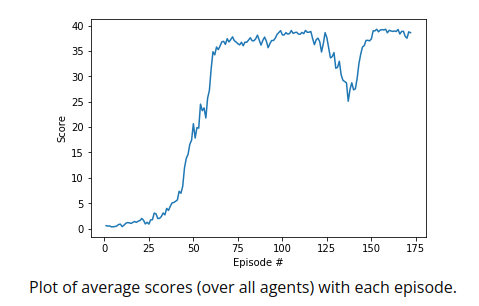

# Udacity Deep Reinforcement Learning: Continuous Control Project

## The Reacher Environment

In this Unity ML-Agents Reacher Environment, a double-jointed arm can move to target locations. A reward of +0.1 is provided for each step that the agent's hand is in the goal location. Thus, the goal of the agent is to maintain its position at the target location for as many time steps as possible.

The observation space consists of 33 variables corresponding to position, rotation, velocity, and angular velocities of the arm. Each action is a vector with four numbers, corresponding to torque applicable to two joints. Every entry in the action vector should be a number between -1 and 1.

### Note

The project environment contains 20 identical agents, each with its own copy of the environment.
The barrier for solving this version of the environment is slightly different than the one with one agent, to take into account the presence of many agents. In particular, the agents must get an average score of +30 (over 100 consecutive episodes, and over all agents). Specifically,

    After each episode, we add up the rewards that each agent received (without discounting), to get a score for each agent. This yields 20 (potentially different) scores. We then take the average of these 20 scores.
    This yields an average score for each episode (where the average is over all 20 agents).

As an example, consider the plot below, where we have plotted the average score (over all 20 agents) obtained with each episode.

The environment is considered solved, when the average (over 100 episodes) of those average scores is at least +30. In the case of the plot above, the environment was solved at episode 63, since the average of the average scores from episodes 64 to 163 (inclusive) was greater than +30.

## Deep Deterministic Policy Gradient (DDPG) Algorithm

Please see https://arxiv.org/abs/1509.02971 for the main idea of this algorithm.

The Udacity implementation of DDPG can be found at ddpg_agent.py and model.py.

Please see the Continuous Control notebook for how the DDPG Agent can be utilized for this project.

Also see Report.md
